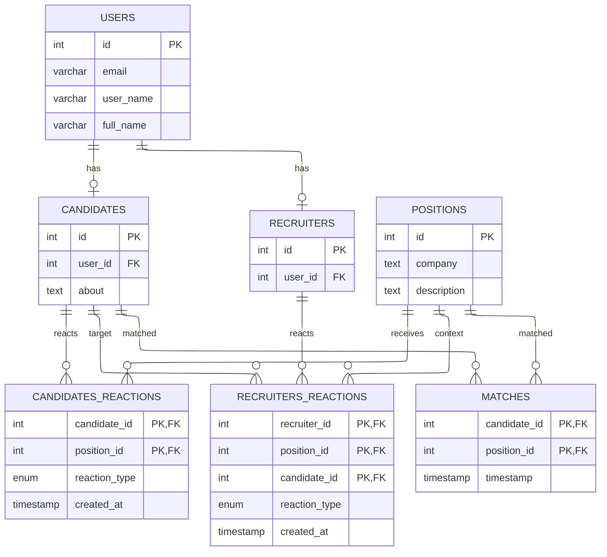

## DB Tables

### general.users
|      Column      |            Type             | Collation | Nullable |      Default      |
|------------------|-----------------------------|-----------|----------|-------------------|
| email            | character varying(512)      |           | not null |                   |
| full_name        | character varying(128)      |           | not null |                   |
| user_name        | character varying(64)       |           | not null |                   |
| id               | uuid                        |           | not null | gen_random_uuid() |
| provider         | character varying(50)       |           | not null |                   |
| provider_user_id | character varying(255)      |           | not null |                   |
| created_at       | timestamp without time zone |           |          | now()             |
| updated_at       | timestamp without time zone |           |          | now()             |

### general.candidates
| Column  |  Type   | Collation | Nullable |                         Default                          |
|---------|---------|-----------|----------|----------------------------------------------------------|
| id      | integer |           | not null | nextval('general.candidates_candidate_id_seq'::regclass) |
| about   | text    |           | not null |                                                          |
| user_id | uuid    |           | not null |                                                          |

### general.recruiters
| Column  |  Type   | Collation | Nullable |                    Default                     |
|---------|---------|-----------|----------|------------------------------------------------|
| id      | integer |           | not null | nextval('general.recruiters_id_seq'::regclass) |
| user_id | uuid    |           | not null |                                                |

### general.positions
|   Column    |          Type          | Collation | Nullable |                        Default                         |
|-------------|------------------------|-----------|----------|--------------------------------------------------------|
| id          | integer                |           | not null | nextval('general.positions_position_id_seq'::regclass) |
| title       | character varying(127) |           | not null |                                                        |
| description | text                   |           | not null |                                                        |
| company     | character varying(127) |           |          |                                                        |

### general.reaction_type_enum
| Name               | Size | Elements |
|--------------------|------|----------|
| reaction_type_enum | 4    | positive+|
|                    |      | negative+|
|                    |      | neutral  |

### general.candidates 
| Column         | Type                | Constraints                |
| -------------  | ------------------- | -------------------------- |
| candidate\_id  | INT                 | PK, FK, ON DELETE CASCADE  |
| position\_id   | INT                 | PK, FK, ON DELETE CASCADE  |
| reaction\_type | reaction_type_enum  | NOT NULL                   |
| created\_at    | TIMESTAMP           | NOT NULL, DEFAULT `NOW()`  |

### general.recruiters_reactions 
| Column         | Type                | Constraints                |
| -------------  | ------------------- | -------------------------- |
| recruiter\_id  | INT                 | PK, FK, ON DELETE CASCADE  |
| position\_id   | INT                 | PK, FK, ON DELETE CASCADE  |
| candidate\_id  | INT                 | PK, FK, ON DELETE CASCADE  |
| reaction\_type | reaction_type_enum  | NOT NULL                   |
| created\_at    | TIMESTAMP           | NOT NULL, DEFAULT `NOW()`  |

### general.matches
| Column        | Type      | Constraints                   |
| ------------  | --------- | ----------------------------- |
| candidate\_id | INT       | PK, FK, ON DELETE CASCADE     |
| position\_id  | INT       | PK, FK, ON DELETE CASCADE     |
| timestamp     | TIMESTAMP | NOT NULL, DEFAULT `NOW()`     |

## general.refresh_tokens
|   Column   |            Type             | Collation | Nullable |      Default      |
|------------|-----------------------------|-----------|----------|-------------------|
| id         | uuid                        |           | not null | gen_random_uuid() |
| user_id    | uuid                        |           | not null |                   |
| token_hash | character varying(255)      |           | not null |                   |
| expires_at | timestamp without time zone |           | not null |                   |
| created_at | timestamp without time zone |           |          | now()             |
| revoked    | boolean                     |           |          | false             |

## ER Diagram

