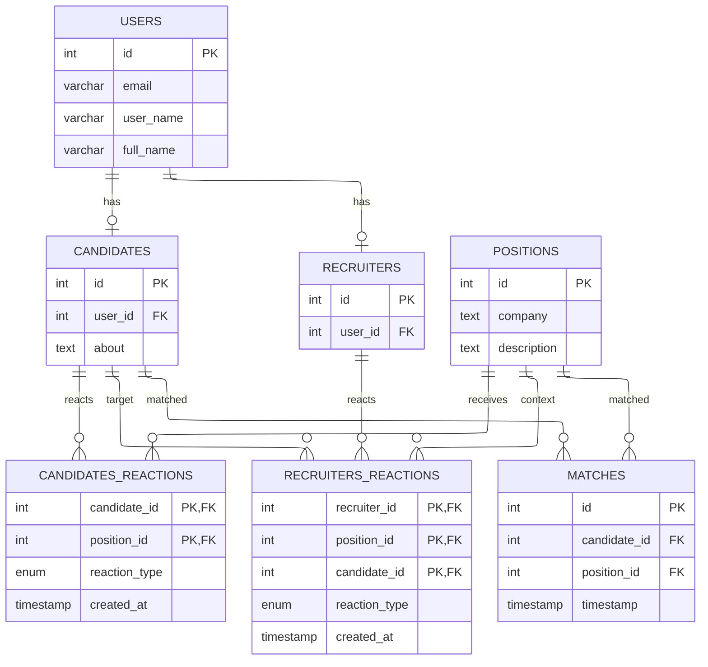

## DB tables

### Users
| Column     | Type         | Constraints      |
| ---------- | ------------ | ---------------- |
| id         | INT          | PK               |
| email      | VARCHAR(512) | NOT NULL, UNIQUE |
| user\_name | VARCHAR(64)  | NOT NULL, UNIQUE |
| full\_name | VARCHAR(128) | NOT NULL         |

### Candidates
| Column   | Type | Constraints                                  |
| -------- | ---- | -------------------------------------------- |
| id       | INT  | PK                                           |
| user\_id | INT  | NOT NULL, FK, ON DELETE CASCADE              |
| about    | TEXT | NOT NULL                                     |

### Recruiters
| Column   | Type | Constraints                                  |
| -------- | ---- | -------------------------------------------- |
| id       | INT  | PK                                           |
| user\_id | INT  | NOT NULL, FK, ON DELETE CASCADE              |

### Positions
| Column      | Type  | Constraints |
|-------------|------ |-------------|
| id          | INT   | PK          |
| title       | TEXT  | NOT NULL    |
| description | TEXT  | NOT NULL    |
| company     | TEXT  |             |

## Candidates' reactions
| Column         | Type                | Constraints                |
| -------------  | ------------------- | -------------------------- |
| candidate\_id  | INT                 | PK, FK, ON DELETE CASCADE  |
| position\_id   | INT                 | PK, FK, ON DELETE CASCADE  |
| reaction\_type | ENUM(like, dislike) | NOT NULL                   |
| created\_at    | TIMESTAMP           | NOT NULL, DEFAULT `NOW()`  |

## Recrutiers' reactions
| Column         | Type                | Constraints                |
| -------------  | ------------------- | -------------------------- |
| recruiter\_id  | INT                 | PK, FK, ON DELETE CASCADE  |
| position\_id   | INT                 | PK, FK, ON DELETE CASCADE  |
| candidate\_id  | INT                 | PK, FK, ON DELETE CASCADE  |
| reaction\_type | ENUM(like, dislike) | NOT NULL                   |
| created\_at    | TIMESTAMP           | NOT NULL, DEFAULT `NOW()`  |

## Matches
| Column        | Type      | Constraints               |
| ------------  | --------- | ------------------------- |
| candidate\_id | INT       | FK, ON DELETE CASCADE     |
| position\_id  | INT       | FK, ON DELETE CASCADE     |
| timestamp     | TIMESTAMP | NOT NULL, DEFAULT `NOW()` |

